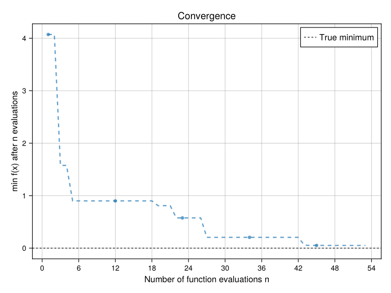
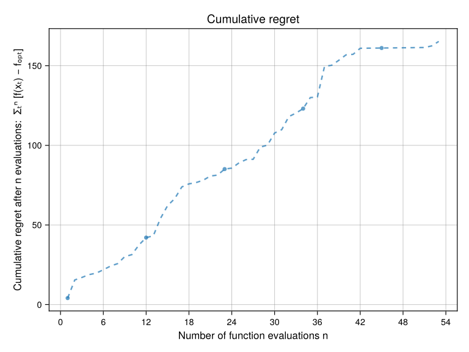
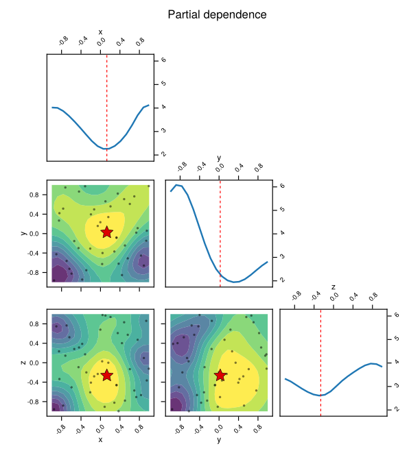
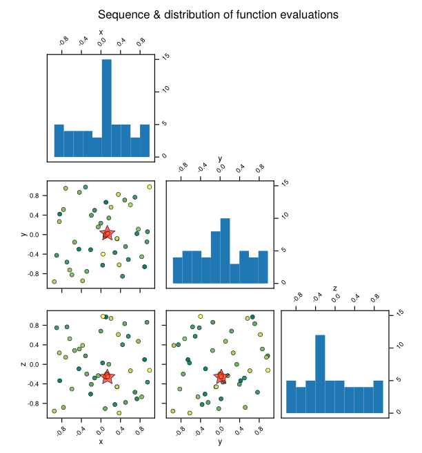
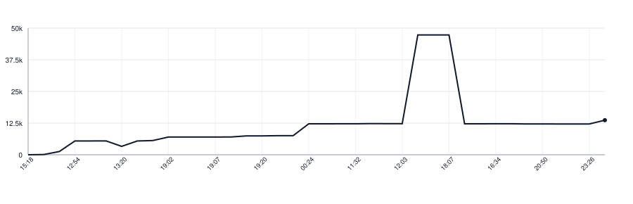

# SAMBO.jl

[](https://D3MZ.github.io/SAMBO.jl/dev/)
[](https://github.com/D3MZ/SAMBO.jl/actions/workflows/CI.yml)
[](https://codecov.io/gh/D3MZ/SAMBO.jl)
[](LICENSE)

Julia-native global black-box optimization with SCE-UA, surrogate model-based
optimization (SMBO), and iterative simplicial homology global optimization (SHGO).
SAMBO.jl supports continuous, integral, and categorical variables, constraints,
ask/tell workflows, threaded evaluation, and optional ecosystem integrations.

## Install

```julia
pkg> add https://github.com/D3MZ/SAMBO.jl
```

## Quick start

```julia
using SAMBO, Random

space = SearchSpace(
    count = 0:99,
    price = Continuous(0.5, 9.0),
    channel = Choices(:search, :social, :print),
)

result = minimize(
    space;
    algorithm=SMBO(),
    maximum_evaluations=100,
    rng=Xoshiro(42),
) do x
    (x.count - 40)^2 + (x.price - 3)^2 +
        (x.channel == :search ? 0 : 10)
end

bestvalue(result)
bestpoint(result)
observations(result)
```

All algorithms share the same interface:

```julia
problem = Problem(f, Box(lower, upper))

solve(problem, SCEUA(); maximum_evaluations=500)
solve(problem, SMBO(); maximum_evaluations=500)
solve(problem, SHGO(); maximum_evaluations=500)
solve(problem, TopologicalMultistart(); maximum_evaluations=500)
```

External or distributed evaluations use identified ask/tell batches:

```julia
state = init(Problem(space), SMBO(); maximum_evaluations=100)
batch = ask!(state, 4)
tell!(state, batch, map(expensive_measurement, batch))
final = result(state)
```

## Configuration policies

Algorithm behavior that changes semantics is explicit:

```julia
smbo = SMBO(
    refit_schedule=FixedRefit(4),
    candidate_sampler=MixtureCandidates(
        UniformCandidates(),
        EliteGaussianCandidates(0.1);
        global_fraction=0.25,
    ),
    candidate_equality=ApproximateCandidateEquality(1e-8),
)

shgo = SHGO(
    topology=DelaunayTopology(),
    minimization_schedule=MinimizeAtTermination(),
)

gp = GaussianProcessSurrogate(
    length_scale=ARDLengthScale([0.2, 0.8]),
    jitter=GeometricJitter(1e-10, 10.0, 8),
)
```

Candidate generators report shortfalls instead of silently switching samplers.
`DelaunayTopology()` reports degenerate complexes instead of substituting a
nearest-neighbor graph; choose `KNearestTopology(neighbors=8)` explicitly when that
topology is intended. Deterministic SurrogatesBase models use `GreedyMean()` or an
explicit uncertainty wrapper such as `DistanceUncertainty(model)`.

The coordinate type is independent of the objective type:

```julia
space32 = SearchSpace(Float32; x=Continuous(-1, 1), n=0:10)
spacebig = SearchSpace(BigFloat; x=Continuous(big"-1", big"1"))
```

## Plotting

Loading Makie activates the diagnostic plotting extension:

```julia
using CairoMakie

convergenceplot(result)
regretplot(result)
objectiveplot(result)
evaluationsplot(result)

save("convergence.png", convergenceplot(result))
save("regret.png", regretplot(result))
save("objective.png", objectiveplot(result))
save("evaluations.png", evaluationsplot(result))
```

The diagnostic suite covers optimization progress, cumulative regret, model
behavior, and the evaluated search space.

| Convergence | Regret |
|---|---|
|  |  |
| Objective / partial dependence | Evaluations |
|  |  |

Package extensions also provide SurrogatesBase, OptimizationBase, and
MLJTuning integration without adding them to the core dependency set.

## Comparison with BlackBoxOptim.jl

SAMBO.jl emphasizes structured search spaces and evaluation-limited algorithms,
while BlackBoxOptim.jl emphasizes population-based stochastic optimization.

| Feature | SAMBO.jl | [BlackBoxOptim.jl](https://github.com/SciML/BlackBoxOptim.jl) |
|---|---|---|
| Primary focus | Structured, evaluation-limited global optimization | Population-based stochastic global optimization |
| Algorithms | SCE-UA, SMBO, SHGO, topological multistart | Differential evolution, NES, direct and memetic search, SPSA, Borg MOEA |
| Search spaces | Named continuous, integer, and categorical variables | Numeric vectors and bounded ranges |
| Constraints | First-class constrained `Problem` | Not part of the primary `bboptimize` interface |
| External evaluation | Identified `ask!`/`tell!` batches | Primarily managed through `bboptimize` |
| Multi-objective optimization | × | Borg MOEA with Pareto fitness |
| Diagnostics | Convergence, regret, partial dependence, evaluations | Progress traces and optimizer comparison |
| Ecosystem integration | CommonSolve, Optimization.jl, MLJ, Tables | BlackBoxOptim API |

## Comparison with Python SAMBO

Both packages expose the same core algorithm families, with different language
ecosystem integrations and workflow APIs.

| Feature | SAMBO.jl | Python SAMBO |
|---|---|---|
| SCE-UA | `solve(problem, SCEUA())` | `minimize(f, bounds=bounds, method="sceua")` |
| SMBO | `solve(problem, SMBO())` | `minimize(f, bounds=bounds, method="smbo")` |
| SHGO | `solve(problem, SHGO())` | `minimize(f, bounds=bounds, method="shgo")` |
| Mixed variables | `SearchSpace(n=0:9, x=Continuous(0, 1), kind=Choices(:a, :b))` | `bounds=[(0, 10), (0., 1.), ("a", "b")]` |
| Constraints | `Problem(f, space; constraint=g)` | `minimize(f, bounds=bounds, constraints=g)` |
| Ask/tell | `batch=ask!(state, n); tell!(state, batch, y)` | `x=opt.ask(n); opt.tell(y, x)` |
| Parallel evaluation | `solve(problem, alg; executor=Threaded())` | `minimize(f, n_jobs=-1, ...)` |
| Tabular observations | `observations(result)` | × |
| Diagnostic plots | `objectiveplot(result)` | `plot_objective(result)` |
| Optimization.jl | `OptimizationBase.solve(problem, SCEUA())` | × |
| MLJ tuning | `SAMBOTuning()` | × |
| scikit-learn search | × | `SamboSearchCV(...)` |

### Rosenbrock microbenchmarks

This compares the native default end-to-end workload in each runtime under the
same objective, budget, and trial identifier.

<sub>Apple M1 Max; median warm-run time over 40 seeded Rosenbrock evaluations using Julia 1.12.6 and Python 3.14.6 with Python SAMBO 1.25.2.</sub>

<!-- benchmark-table:start -->
| Algorithm | Julia | Python | Improvement |
|---|---:|---:|---:|
| SCE-UA | 0.0221 ms | 1.433 ms | 64.8× faster |
| SMBO | 12.722 ms | 681.298 ms | 53.6× faster |
| SHGO | 0.0403 ms | 1.821 ms | 45.2× faster |
<!-- benchmark-table:end -->

Run the benchmark:

```sh
julia --project=benchmark benchmark/benchmarks.jl
python3 benchmark/python_reference.py
```

Replace the saved files in `benchmark/results/` and run
`python3 benchmark/update_readme.py` to regenerate the checked-in table.

### Cross-runtime solution-quality checks

This checks whether the Julia and Python implementations reach comparable solutions on difficult problems.

Identical objective formulas and bounds were tested over five independent trial
identifiers; the runtimes use their native RNG implementations.
SCE-UA and SHGO received 1,000 evaluations and SMBO received 300. The rotated, shifted
five-dimensional cases test multimodality, conditioning, and nonseparability
robustness rather than rotation invariance of an axis-aligned box. Targets were
fixed in the scripts before running the matrix.

The scheduled gate separately requires at least four of five trials to reach
practical quality thresholds of −2.0, 50, and 200 for Hartmann-6, Rastrigin-5,
and Rosenbrock-5, then applies a 0.25-decade paired non-inferiority margin above
those thresholds.

<sub>Each cell: median final objective; target hits across five trials. Julia 1.12.6; Python 3.14.6 with SAMBO 1.25.2.</sub>

<!-- correctness-table:start -->
| Algorithm | Problem (known optimum; target) | Julia | Python |
|---|---|---:|---:|
| SCE-UA | Hartmann-6 (−3.322; ≤ −2.8) | −3.32; 5/5 | −3.276; 5/5 |
| SCE-UA | Rotated Rastrigin-5 (0; ≤ 12) | 9.882; 3/5 | 17.258; 0/5 |
| SCE-UA | Rotated Rosenbrock-5 (0; ≤ 12) | 2.598; 5/5 | 12.298; 2/5 |
| SMBO | Hartmann-6 (−3.322; ≤ −2.8) | −3.262; 5/5 | −2.426; 2/5 |
| SMBO | Rotated Rastrigin-5 (0; ≤ 12) | 8.568; 4/5 | 36.074; 0/5 |
| SMBO | Rotated Rosenbrock-5 (0; ≤ 12) | 44.823; 0/5 | 99.929; 0/5 |
| SHGO | Hartmann-6 (−3.322; ≤ −2.8) | −3.261; 5/5 | −3.322; 5/5 |
| SHGO | Rotated Rastrigin-5 (0; ≤ 12) | 14.264; 2/5 | 2.985; 5/5 |
| SHGO | Rotated Rosenbrock-5 (0; ≤ 12) | 6.011; 5/5 | 4.28e−09; 5/5 |
<!-- correctness-table:end -->

Reproduce the matrix:

```sh
julia --project=. benchmark/correctness_julia.jl > julia-correctness.csv
python3 benchmark/correctness_python.py > python-correctness.csv
python3 benchmark/compare_correctness.py julia-correctness.csv python-correctness.csv
python3 benchmark/update_correctness_readme.py README.md julia-correctness.csv python-correctness.csv
```

## Lines of Code Over Time

<picture>
  <source media="(prefers-color-scheme: dark)" srcset=".github/loc-history-dark.svg">
  <source media="(prefers-color-scheme: light)" srcset=".github/loc-history-light.svg">
  
</picture>

## License

MIT © 2026 Demetrius Michael.

## Citation

If you use SAMBO.jl in research, cite:

```bibtex
@software{Michael_SAMBO_jl_2026,
  author  = {Michael, Demetrius},
  title   = {{SAMBO.jl}: Julia-native global black-box optimization},
  year    = {2026},
  version = {0.1.0-DEV},
  url     = {https://github.com/D3MZ/SAMBO.jl}
}
```

Machine-readable citation metadata is provided in `CITATION.cff`; the complete
algorithm bibliography is available in `references.bib`.

## Bibliography

1. Q. Duan, S. Sorooshian, and V. Gupta, “Effective and Efficient Global
   Optimization for Conceptual Rainfall-Runoff Models,” *Water Resources
   Research* 28(4), 1015–1031 (1992).
   [doi:10.1029/91WR02985](https://doi.org/10.1029/91WR02985)
2. D. R. Jones, M. Schonlau, and W. J. Welch, “Efficient Global Optimization
   of Expensive Black-Box Functions,” *Journal of Global Optimization* 13,
   455–492 (1998).
   [doi:10.1023/A:1008306431147](https://doi.org/10.1023/A:1008306431147)
3. C. E. Rasmussen and C. K. I. Williams, *Gaussian Processes for Machine
   Learning*, MIT Press (2006).
   [ISBN 978-0-262-18253-9](https://gaussianprocess.org/gpml/)
4. S. C. Endres, C. Sandrock, and W. W. Focke, “A Simplicial Homology
   Algorithm for Lipschitz Optimisation,” *Journal of Global Optimization*
   72, 181–217 (2018).
   [doi:10.1007/s10898-018-0645-y](https://doi.org/10.1007/s10898-018-0645-y)
5. J. H. Halton, “On the Efficiency of Certain Quasi-Random Sequences of
   Points in Evaluating Multi-Dimensional Integrals,” *Numerische Mathematik*
   2, 84–90 (1960).
   [doi:10.1007/BF01386213](https://doi.org/10.1007/BF01386213)
6. I. M. Sobol’, “On the Distribution of Points in a Cube and the Approximate
   Evaluation of Integrals,” *USSR Computational Mathematics and Mathematical
   Physics* 7(4), 86–112 (1967).
   [doi:10.1016/0041-5553(67)90144-9](https://doi.org/10.1016/0041-5553(67)90144-9)
7. M. D. McKay, R. J. Beckman, and W. J. Conover, “A Comparison of Three
   Methods for Selecting Values of Input Variables in the Analysis of Output
   from a Computer Code,” *Technometrics* 21(2), 239–245 (1979).
   [doi:10.1080/00401706.1979.10489755](https://doi.org/10.1080/00401706.1979.10489755)
